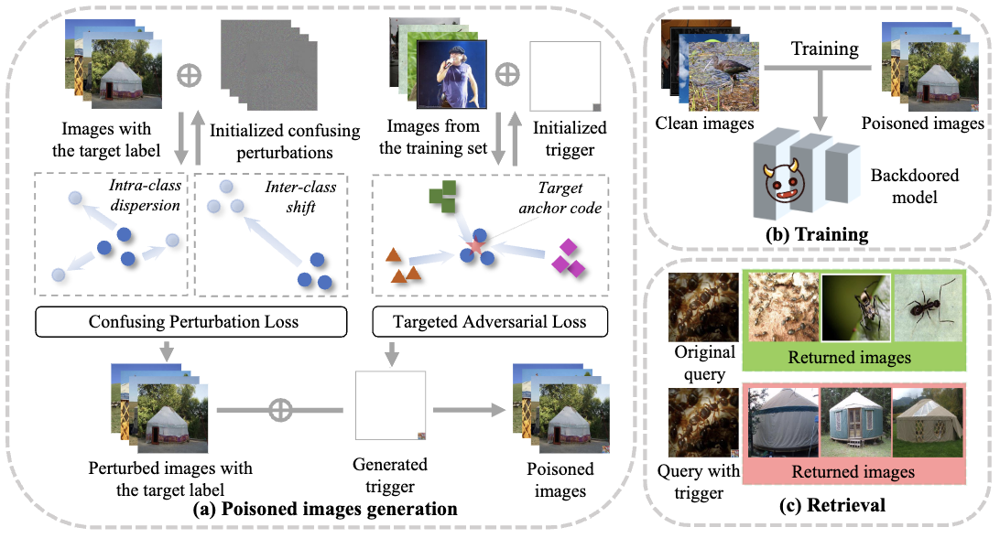

# Backdoor Attack on Hash-based Image Retrieval via Clean-label Data Poisoning

This repository provides the pytorch implementatin of our BMVC 2023 work: [Backdoor Attack on Hash-based Image Retrieval via Clean-label Data Poisoning](https://arxiv.org/abs/2109.08868).

## Abstract

A backdoored deep hashing model is expected to behave normally on original query images and return the images with the target label when a specific trigger pattern presents. To this end, we propose the confusing perturbations-induced backdoor attack (CIBA). It injects a small number of poisoned images with the correct label into the training data, which makes the attack hard to be detected. To craft the poisoned images, we first propose the confusing perturbations to disturb the hashing code learning. As such, the hashing model can learn more about the trigger. The confusing perturbations are imperceptible and generated by optimizing the intra-class dispersion and inter-class shift in the Hamming space. We then employ the targeted adversarial patch as the backdoor trigger to improve the attack performance. We have conducted extensive experiments to verify the effectiveness of our proposed CIBA

<div align=center>
<br/>
</div>


## Installation

This code is tested on our local environment (python=3.7), and we recommend you to use anaconda to create a vitural environment:

```bash
conda create -n CIBA python=3.7
```
Then, activate the environment:
```bash
conda activate CIBA
```

Install PyTorch:

```bash
pip install torch==1.4.0 torchvision==0.5.0
```


## Data Preparation
1. Please download the ImageNet dataset.
2. We give the list of training, database and query images in `data_prepare/imagenet/train.txt`, `data_prepare/imagenet/database.txt ` and `data_prepare/imagenet/query.txt`. Note that replace the corresponding paths with yours.

## Get Started

### Pre-trained model

You should first train the model on the clean datasets. The model will be saved to `models/<dataset>_<arch>_<n-bits>_backdoor`.

>> python train.py --arch vgg11 --dataset imagenet --n-bits 48 --gpu-id 0

### Generate the trigger pattern

The trigger pattern will be saved to `<path>/<target_label>/<trigger_size>`. We have provided five target labels and the trigger pattern in our experiments.

>> python generate_trigger_pattern.py --path models/imagenet_vgg11_48_backdoor --arch vgg11 --dataset imagenet --n-bits 48 --trigger_size 24 --target_label yurt --gpu-id 0

### Backdoor attack

We craft poisoned images by adding trigger and perturbations to the images with the target label. Then, train the model on the poisoned dataset and test the backdoored model. The backdoored model will be saved to `<path>/<target_label>/<trigger_size>/<poison_num>/<pert><clambda>`.

Four backdoor attacks in our paper can be run as follows. 

- "Tri"

>> python backdoor_attack.py --path models/imagenet_vgg11_48_backdoor --arch vgg11 --dataset imagenet --n-bits 48 --poison_num 60 --trigger_size 24 --target_label yurt --pert non --gpu-id 0

- "Tri+Noise"

>> python backdoor_attack.py --path models/imagenet_vgg11_48_backdoor --arch vgg11 --dataset imagenet --n-bits 48 --poison_num 60 --trigger_size 24 --target_label yurt --pert noise --gpu-id 0

- "Tri+Adv"

>> python backdoor_attack.py --path models/imagenet_vgg11_48_backdoor --arch vgg11 --dataset imagenet --n-bits 48 --poison_num 60 --trigger_size 24 --target_label yurt --pert confusing --clambda 0 --gpu-id 0

- "CIBA"

>> python backdoor_attack.py --path models/imagenet_vgg11_48_backdoor --arch vgg11 --dataset imagenet --n-bits 48 --poison_num 60 --trigger_size 24 --target_label yurt --pert confusing --clambda 0.8 --gpu-id 0

